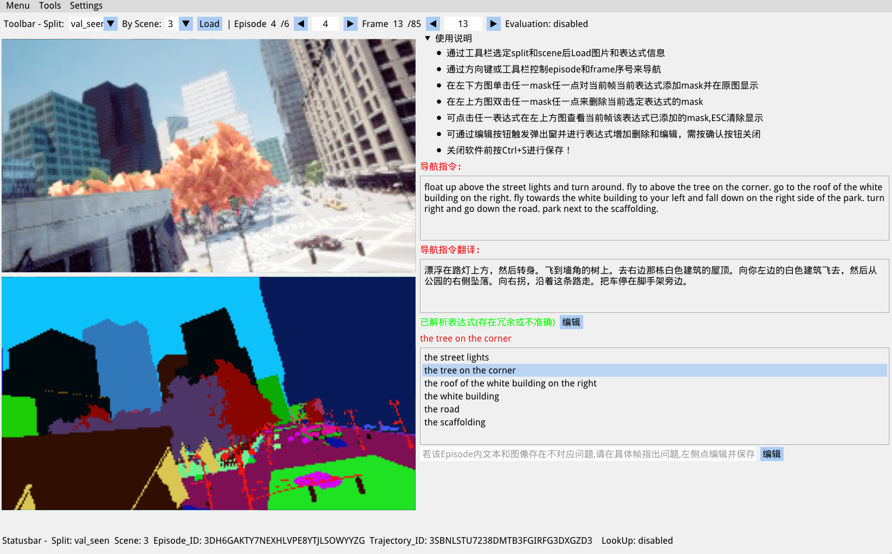

# Annotation Software for AirVLN Referring Expression

This is an annotation software applying to AirVLN dataset for annotating referring objects in the instruction for each navigation step.



## Prerequisites

### Environment

Python 3.8 or higher:

- numpy
- opencv-python
- nltk
- stanfordcorenlp
- airsim
- dearpygui
- dearpygui_ext

> We recommand that using conda create a 3.8 python virtual environment and just run pip install -r requirements.txt in the root path.

### Software Installing

Just run `git clone https://github.com/XIRZC/REAnnotor.git` for cloning the application repository.

### Data

Preparing the AirVLN dataset into `scenes` folder which comprises of 25 airsim scenarios, and we will provide you with download links.

After downloading 25 scenarios, you can just use `scripts/stsplit.sh` for whole split scene running in the background, or use `scripts/stscene.sh` for single scene running for scene-seperate case. And you must ensure you have `settings` subfolder in the root path.

After running the corresponding scenarios, just use `scripts/save_imgs.sh` for saving the corresponding episodes frames gotten in each navigation position. And you must ensure you have `annotation` subfolder in the root path. And you will get `data/${split}/${scene}/origin` and `data/${split}/${scene}/seg` folder including corresponding original and segementation images, and get each episode expression `expressions.json` in each episode subfolder.

### Workspace

``` txt
.
├── annotations
│   ├── test
│   ├── train
│   ├── val_seen
│   └── val_unseen
├── data
│   ├── train
│   │   ├── origin
│   │   └── seg
│   ├── val_seen
│   │   ├── origin
│   │   └── seg
│   ├── val_unseen
│   │   ├── origin
│   │   └── seg
│   ├── test
│       ├── origin
│       └── seg
├── resources
├── scenes
│   ├── 10-ModularEuropean
│   ├── 11-facades
│   ├── 12-IndustrialArea
│   ├── 13-OldTown
│   ├── 14-ModernCity
│   ├── 15-Yard
│   ├── 16-NYC
│   ├── 17-TrainStation
│   ├── 18-Brushify
│   ├── 1-CityParkCollec
│   ├── 20-OldShipyard
│   ├── 21-ContainerYard
│   ├── 22-SteampunkEnvironment
│   ├── 23-UrbanJapan
│   ├── 24-HongKongStreet
│   ├── 25-CityDowntown
│   ├── 26-ModularCity
│   ├── 2-ScansUrban
│   ├── 3-DownTown
│   ├── 4-FactoryDistrict
│   ├── 5-AbandonedCity
│   ├── 6-ModularNeighborhood
│   ├── 7-NordicHarbour
│   ├── 8-slums
│   └── 9-TankCleaningCenter
├── scripts
├── settings
└── utils
```

## Using the software for annotating

Just run `python main.py` in the root path with above prepared conda python vitual environment for launching the softare.

And here are several steps for annotating referring objects list below(w. demonstration pictures):

1. Choose split and scene, by top toolbar, and press load button for loading corresponding episodes data into memory.

2. Navigate for different episode and frame in each episode by changing episode and frame idx. There are three ways for changing episode and frame.

    - Arrow keys: Up and Down for episode idx minus and plus, left and right for frame idx minus and plus.

    - Arrow keys: H and L for episode idx minus and plus, J and K for frame idx plus and minus.

    - Toolbar arrow buttons and sliders.

3. There are mainly five parts in the application window:

    1. Menu bar for some dearpygui toolkits and software settings

    2. Top Toolbar for changing split|scene|episode_idx|frame_idx

    3. Left window including original and corresponding segmentation frame

    4. Right window comprising navigation instructions and translated instructions, parsed not accurate referring expressions, and software using instructions. And you can popup expressions edit window by press edit button.

    5. Bottom Statusbar for current split|scene|episode_id|trajectory_id

4. Edit expressions:

    1. activate popup edit window by pressing the edit button

    2. update expressions by simply enter text into the input box, and it will be automatically saved into the episodes memory

    3. add expressions by pressing `Add` buttons, and it will insert an input box above the pressed location.

    4. delete expressions by simply pressing the corresponding `Delete` buttons.

5. Edit Masks:

    1. show masks by simply select an expression in the selectable list, and it will show masks in the original frame

    2. add masks by simply mouse single-press one point in the target mask in the segmentation frame after selecting an expression

    3. delete mask by simply mouse double-press one point in the target mask in the original frame after selecting an expression

6. Cltr+S or Menubar save json for save current work state into corresponding `annotations/${split}/${scene}_seg.json`


## Advanced Features

1. LookUp Mode(Ctrl + W for toggling): navigating for directly show all masks in this frame in order to not select one expression 

2. Evaluation Mode(Ctrl + F for toggling): randomly shuffle 10% episodes for evalulation

3. BugReport Mode(Just Editing): point out errors in the original AirVLN Dataset Annotations